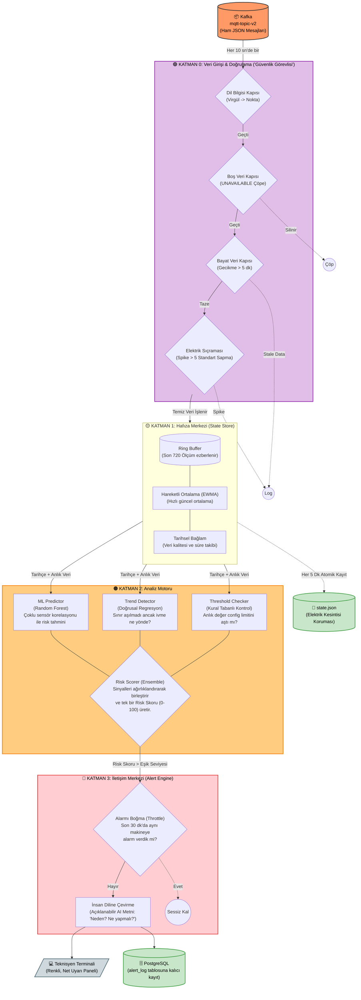

# 🚀 CODLEAN MES — YZ Destekli Kestirimci Bakım & Üretim Yürütme Sistemi

> *"Kusursuz Üretim İçin Kendi Kendini Dinleyen Yapay Zeka"*

Codlean MES, endüstriyel tesisler için geliştirilmiş, geleneksel eşik değer (rule-based) sistemlerinin katı yapısını **Makine Öğrenimi (ML)** algoritmalarının öngörücü gücüyle harmanlayan **eşsiz bir hibrit mimaridir**. Pazardaki diğer standart OEE (Genel Ekipman Etkinliği) veya IoT analiz ekranlarının aksine, Codlean sadece "ne olduğunu" göstermekle kalmaz; arka plandaki canlı veri akışını işleyerek "ne olacağını, ne zaman olacağını ve nasıl önleneceğini" saniyeler içinde hesaplar.

---

## 🌟 Neden Eşsiz? (Peerless Architecture)

Piyasadaki standart kestirimci bakım çözümleri genellikle tek boyutlu çalışır (ya sadece kural tabanlı alarm verirler ya da sadece ML tahmini yaparlar). Codlean MES ise veriyi **4 farklı filtre ve akıl katmanında** işleyerek fabrikada adeta bir "Dijital İkiz (Digital Twin)" bilinci yaratır:

1. **Hiper-Hassas Hibrit Algılama**: Teknisyenin tecrübesine dayalı (%100 Kesin) kural limitleri ile Yapay Zeka öngörüsünü (Olası Arıza Algısı) tek potada ustaca harmanlar.
2. **Kayıpsız Zaman Makinesi (Historical Replay)**: Gerçek Kafka sunucusuyla olan bağlantı dahi kopsa, sistem geçmişte kaydedilmiş devasa arıza loglarını (*violation_log.json*) saniye saniye simüle edebilen benzersiz ve izole bir stres-test altyapısına sahiptir.
3. **Maliyet Odaklı Karar Mekanizması (Cost-Aware Threshold)**: Endüstri 4.0'ın en büyük problemi olan "yanlış alarm verme korkusuyla gerçek arızaları kaçırma" handikapını yüksek hassasiyet (Recall) stratejisiyle çözer. Sistemin ana odağı hiçbir tehlikeyi şansa bırakmamaktır.

---

## 🏗️ Hibrit Pipeline Mimarisi

Makine sensörlerinden (Basınç, Yağ Sıcaklığı, Titreşim, Tork vb.) saniyede yüzlerce kez fırlayan veriler, teknisyenin ekranına anlamlı bir öneri olarak düşmeden önce aşağıdaki **4 aşamalı fabrikasyon sürecinden (Pipeline)** geçer:



### 🧩 Mimari Katmanların Detaylı İncelemesi

*   **🟢 KATMAN 0 (Veri Girişi & Doğrulama)**: Sistemin "Güvenlik Görevlisidir". Sensörden gelen gürültülü (noisy), veri tabanı uyumsuz (spike/anomaly) veya kopuk statik mesajları daha kapıdayken süzer. Sisteme sadece analiz edilmeye değer, "temiz ve taze" kanın pompalanmasını garanti eder.
*   **🟡 KATMAN 1 (Hafıza Merkezi - State Store)**: Codlean sadece saniyelik değerlere bakarak yanılgıya düşmez. Önündeki son 12 saatin bağlamını (context) ve hareketli ortalamalarını (EWMA) mikro-saniyeler içinde hesaplayarak ezberler. Elektrik kesintisi veya sistem yeniden başlatılması durumunda disk tabanlı koruma (state.json) ile hafızasını kaybetmez.
*   **🟠 KATMAN 2 (Analiz Motoru - Hybrid AI)**: Uygulamanın beynidir. Sadece limit aşımını (Threshold Checker) kontrol edip geçmez; makine öğrenimi modelleri (XGBoost/Random Forest) ile çoklu sensör korelasyonunu algılayarak, gözle görülemeyen teknik yıpranmaları sezer. *"Limitlere henüz ulaşılmadı ancak ivmelenme hızına bakılırsa 30 dakika içinde ana valf hatası yaşanacak"* seviyesinde derin bir felsefeyle rapor üretir.
*   **🔴 KATMAN 3 (İletişim & Alert Engine)**: Teknisyene ve üretim şefine teknolojik yorgunluk (Alert Fatigue) yaşatmamak için kurgulanmıştır. Peş peşe gelen onlarca tehlike sinyalini filtreler, sınıflandırır ve kanıtlanmış anomalileri *"İnsan Diliyle Açıklanabilir Çözümler"* şeklinde (Örn: `🚨 Makineyi durdurun, yağ pompası basınç kaybediyor!`) sunar.

---

## 📍 Geliştirme Yol Haritası (Milestone Checkpoints)

Proje sürekli evrilen bir Ar-Ge kültürünün ürünüdür:

1. **Checkpoint 1.0**: Temel Kafka Consumer (dinleyici) ve State Store hafıza mantığının kurgulanması.
2. **Checkpoint 2.0**: İleri düzey Random Forest algoritmalarının devasa bir geçmiş veri seti üzerinden (`ml_training_data.csv`) eğitilmesi ve çekirdek yapıya entegrasyonu.
3. **Checkpoint 3.0**: Standart spagetti kodların kırılıp bağımsız bir endüstri standardına (src/, tests/, docs/, scripts/) refactor edilmesi. Ergonomik 3-Bölmeli Dinamik GUI inşası.
4. **Checkpoint 4.0 (GÜNCEL)**: **Historical Replay Zaman Makinesi** ile sahte (mock) simülasyonların sistemden kazınması. Hibrit AI Risk motorunun tam entegrasyonu ve siber güvenlik/network kısıtlarına rağmen "Canlı Test (Production-Ready Live Simulation)" senaryosunun hayata geçirilmesi.

---

## 🛠️ Nasıl Çalıştırılır?

Tek bir endüstriyel komut ile sistemin zekasını canlı olarak test edebilirsiniz:

```bash
# Bağımlılık dizinlerini tanıması için PYTHONPATH kullanılarak Dashboard simülasyonu başlatılır:
PYTHONPATH=. python src/ui/dashboard_pro.py
```
*(Komut çalıştırıldığında sistem saniyeler içinde binlerce satırlık geçmiş arıza verilerini okumaya başlar ve terminalde şeffaf bir yapay zeka deneyimi sunar.)*
