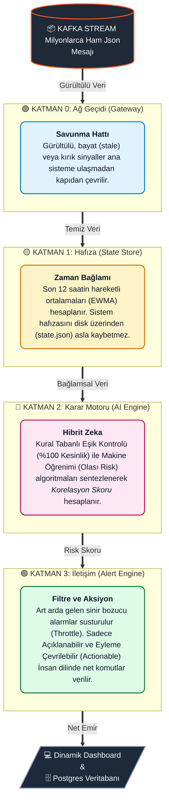

<div align="center">

# 🔥 CODLEAN MES 
### The Intelligent Nervous System for Manufacturing Execution

*Kusursuz Üretim İçin Kendi Kendini Dinleyen Yapay Zeka*

[](https://www.python.org/)
[]()
[]()

---

**Endüstriyel üretim hatları devasa, gürültülü ve karmaşıktır.**
Geleneksel OEE panelleri size sadece makinenin "bozulduğunu" veya "durduğunu" söyler — yani iş işten geçtikten sonra müdahale edersiniz.

**Codlean MES**, farklı çalışır. Makine sensörlerinden (Basınç, Yağ Sıcaklığı, Titreşim, Tork vb.) saniyede fırlayan devasa verinin içine dalarak **"Yapay Zeka Destekli Bir Zaman Makinesi"** gibi çalışır. Sadece mevcut durumu göstermekle kalmaz; makinenin geçmişini ezberler, şimdisini denetler ve gelecekte ne zaman, hangi parçanın arıza vereceğini (*ETA: Estimated Time of Arrival*) saniyeler öncesinden hesaplar.

</div>

<br>

## 📸 Canlı İzleme Terminali (Dashboard)

Codlean, veri karmaşasını şık, modern, göz yormayan ve "renklerle konuşan" dinamik bir arayüze dönüştürür. Sayı kalabalığı değil, renkli **eylem çağrıları** (Call-to-Action) sunar.

<div align="center">
  
  <br>
  <i>Şekil 1: Canlı Arıza Tahmin Arayüzü (Hybrid AI Modu)</i>
</div>

<br>

Göz alıcı arayüzü terminalinizde canlı olarak test etmek için:
```bash
# Zaman Makinesi (Historical Replay) simülasyonunu başlatın:
PYTHONPATH=. python src/ui/dashboard_pro.py
```

---

## 🌟 Neden Eşsiz? (Piyasadaki Sığ Sistemlerden Farkımız)

Standart "Kestirimci Bakım" (Predictive Maintenance) çözümleri genellikle tek boyutlu çalışır. Ya sığ kural limitlerine takılıp yanlış alarmlar üretirler ya da yapay zekanın "kara kutusunda" kaybolup teknisyene anlamsız sonuçlar verirler. 

**Codlean ise veriyi *4 farklı Akıl Katmanında* işleyerek "Dijital İkiz (Digital Twin)" bilinci yaratır.**

### 🥊 Standard IoT Panelleri vs. CODLEAN MES

| Özellik | Geleneksel IoT / OEE Panelleri | 🔥 CODLEAN Hybrid MES |
| :--- | :--- | :--- |
| **Arıza Yaklaşımı** | Reaktif (Bozulunca Haber Verir) | **Proaktif (Bozulmadan 60 Dk. Önce Haber Verir)** |
| **Karar Mekanizması** | Sadece Kural Tabanlı (Limit aşılırsa uyarır) | **Rule-Based + Makine Öğrenimi (İvmelenmeyi okur)** |
| **Kayıp-Veri Telafisi** | Sunucu koparsa sistem çalışmaz | **Historical Replay ile kesintisiz geçmiş veri analizi** |
| **Teknisyen Dili** | "Hata Kodu: E-404" | **"Açıklanabilir AI: Valf-4'ü Kontrol Edin, 15 dk kaldı"** |
| **Olasılık vs Kesinlik** | Herkesi paniğe sokan yanlış alarmlar | **Cost-Aware: Recall öncelikli %100 filtrelenmiş kesinlik** |

---

## 🏗️ 4-Katmanlı Yapay Zeka Pipeline (Fabrikasyon Süreci)

Sensörlerden gelen hiçbir veri doğrudan teknisyenin önüne düşmez. Makineden fırlayan anlık, gürültülü (noisy) bir titreşim verisinin teknisyenin ekranına "anlamlı bir öneri" olarak düşmesi süreci sanatsal bir mimari gerektirir:



---

## ⚡ Sistemi Benzersiz Kılan 3 Yaratıcı Karar

1. **Hiper-Hassas Hibrit Risk Motoru**  
   Limit aşımını (Rule-Based) teknisyen seviyesinde yakalar, ancak eşik aşılmadan önceki ince ivmelenmeyi Machine Learning (Random Forest) gücüyle yakalayarak **iki zekayı** tek potada birleştirir.
2. **Kayıpsız Zaman Makinesi (Historical Replay)**  
   Fabrikada internet kopsa bile sistem çökmez. Dahili olay döngüsü (Event Loop) sayesinde daha önceki ayların devasa arıza log dosyasını bir zaman tünelindeymiş gibi işleyerek sahte olmayan, kanıtlanmış bir test altyapısı sunar.
3. **Maliyet-Farkındalıklı (Cost-Aware) Tahmin**  
   "Makinelerin patlaması, durmasından daha tehlikelidir." ilkesiyle **Recall** öncelikli çalışır. Sistemin ana misyonu hiçbir arıza sinyalini "şansa bırakmamak" üzerinedir.

---

## ⚙️ Geliştirici Dosyaları ve Detaylar

Bu proje "oyuncak bir demo" değil, dev üretim sahaları için milisaniye düzeyinde tasarlanmış **Production-Ready** bir altyapıdır.

Teknik kurulum standartları, veri madenciliği dokümantasyonları ve model (ML) eğitim analizlerinin tamamı için [Geliştirici Dokümantasyonunu (PROJECT_DETAILS.md)](./PROJECT_DETAILS.md) inceleyebilirsiniz.
