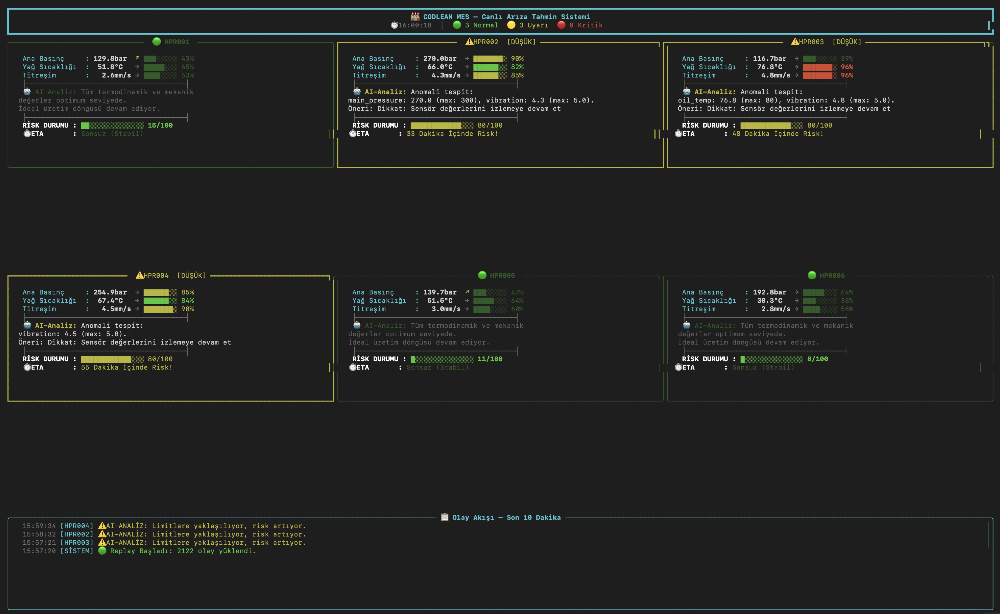

<div align="center">

# 🔥 CODLEAN MES 
### The Intelligent Nervous System for Manufacturing Execution

*Kusursuz Üretim İçin Kendi Kendini Dinleyen Yapay Zeka*

[](https://www.python.org/)
[]()
[]()

---

**Endüstriyel üretim hatları devasa, gürültülü ve karmaşıktır.**
Geleneksel OEE panelleri size sadece makinenin "bozulduğunu" veya "durduğunu" söyler — yani iş işten geçtikten sonra müdahale edersiniz.

**Codlean MES**, makine sensörlerinden (Basınç, Yağ Sıcaklığı, Titreşim, Tork vb.) saniyede fırlayan devasa verinin içine dalarak **"Yapay Zeka Destekli Bir Zaman Makinesi"** gibi çalışır. Sadece mevcut durumu göstermekle kalmaz; makinenin geçmişini ezberler, şimdisini denetler ve gelecekte ne zaman, hangi parçanın arıza vereceğini saniyeler öncesinden hesaplar.

</div>

<br>

## 📸 Canlı İzleme Terminali (Dashboard)

Codlean, veri karmaşasını şık, modern, göz yormayan ve "renklerle konuşan" dinamik bir arayüze dönüştürür. 

<div align="center">
  
  <br>
  <i>Şekil 1: Canlı Arıza Tahmin Arayüzü (Hybrid AI Modu)</i>
</div>

<br>

Göz alıcı arayüzü terminalinizde canlı olarak test etmek için:
```bash
# Zaman Makinesi (Historical Replay) simülasyonunu başlatın:
PYTHONPATH=. python src/ui/dashboard_pro.py
```

---

## 🏗️ 4-Katmanlı Yapay Zeka Pipeline Mimarisi

Makineden fırlayan anlık, gürültülü (noisy) bir titreşim verisinin teknisyenin ekranına "anlamlı bir öneri" olarak düşmesi süreci sanatsal bir mimari gerektirir.

<div align="center">
  
  <br>
  <i>Şekil 2: 4-Katmanlı Hibrit Yapay Zeka Fabrikasyon Mimarisi</i>
</div>

<br>

Veri akışı şu teknik süzgeçlerden geçer:

### 🟢 KATMAN 0: Ağ Geçidi & Güvenlik Görevlisi (Gateway Layer)
Sensörlerden fırlayan devasa Kafka verisi ana sisteme ulaşmaya çalışırken bu katmanda filtrelenir:
- **Format ও Dil Bilgisi Kontrolü:** Hatalı formattaki (virgül/nokta hataları) sensör değerlerini onarır.
- **Kopuk Sensör Reddi:** `UNAVAILABLE` veya boş paketleri reddeder.
- **Bayat Veri (Stale Data) Engeli:** Ağ gecikmesi nedeniyle 5 dakika geç gelen paketler zaman çizelgesini bozmamak adına çöpe atılır.
- **Spike Filtresi:** Elektrik sıçramaları gibi 5 standart sapmalık (*5-sigma*) anlık pikler silinir ki ML modelleri bunu arıza sanmasın.

### 🟡 KATMAN 1: Kısa Süreli Hafıza Merkezi (State Store)
Yapay Zeka izole 1 saniyelik değerlere bakarak karar vermez.
- **Ring Buffer (Kayan Pencere):** Tüm makine sensörlerinin son 12 saatteki (veya son 720 kayıt) ölçümlerini anlık bellekte milisaniyeler içinde saklar.
- **Hareketli Ortalama (EWMA):** Zaman serilerindeki anlık gürültüleri filtreleyip eylemsizlik trendini hesaplar.
- **Disk Koruması:** Sistem aniden kapansa dahi `state.json` üzerinden tüm hafızayı saniyede geri yükler.

### 🔴 KATMAN 2: Karar Motoru & Hibrit Zeka (AI Engine)
Uygulamanın ana beynidir. İki bağımsız otonom sistemi tek potada eritir:
- **Kural Tabanlı Threshold (%100 Kesinlik):** Basınç 150 Bar sınırını aştı ise bu teknisyen onaylı "kesin" bir arızadır. Şansa veya makine öğrenimi tahminine bırakılmaz; derhal müdahale emri verilir.
- **Makine Öğrenimi (ML Predictor):** Değerler henüz 120 Bar gibi normal sınırlardadır. Ancak *Random Forest* veya *XGBoost* modeli; Tork, Titreşim ve Sıcaklık parametrelerindeki eş zamanlı ufak dalgalanmaları ve "mikro ivmelenmeleri" saptayarak: *"Mevcut ivme korunursa ana valf 45 dakika içinde arızaya geçecek"* öngörüsünü üretir.
- **Ensemble Risk Scorer:** İki sistemin çıktılarını harmanlayarak 0-100 arasında net bir risk skoru basar.

### 🟢 KATMAN 3: İletişim & Alert Engine
Bu katman "Açıklanabilir Yapay Zeka" (XAI) ilkesini benimser.
- **Alarm Boğma (Throttle):** "Teknoloji Yorgunluğunu" engellemek adına aynı makine için saniyede 10 kez alarm üretmek yerine 30 dakikalık periyotlarla tok ve net uyarılar geçer.
- **Actionable AI (Eyleme Dönüştürülebilir Çıktı):** Ekrana `Hata Kodu 404` veya `Skor %84` şeklinde anlamsız çıktılar basmaz. Doğrudan: 
  > 🚨 *AI-Analiz: Valf sınır değerlere yaklaşıyor, titreşim artış trendinde. Öneri: Soğutma suyunu artırın, Makineyi rölantiye alın. (ETA: 35 Dk)* 
şeklinde insan dilinde direktif verir.

---

## ⚡ Sistemi Benzersiz Kılan Özellikler

- **Maliyet-Farkındalıklı (Cost-Aware) Tahminleme:** Makinelerin duruş maliyeti, onarım maliyetinden katbekat yüksektir. Algoritma **Recall** (Duyarlılık) oranını maksimize eder; asgari bir şüphede dahi teknik ekibi tetikler, böylece potansiyel arızalar şansa bırakılmaz.
- **Kayıpsız Zaman Makinesi (Historical Replay Engine):** Fabrika lokal ağ bağlantısını veya Kafka erişimini kaybetse dahi, sistem kendi içindeki *Event Loop* motoru sayesinde gigabytelarca geçmiş *violation_log.json* verisini saniye saniye işleyerek sahte olmayan, kanıtlanmış bir test & simülasyon altyapısı sunar.

---

## ⚙️ Geliştirici Kaynakları

Daha derinlemesine teknik detaylar, sınıf yapıları, XGBoost model eğitim matrisleri ve veri hazırlık (preprocessing) pipeline analizleri için [Geliştirici Dokümantasyonunu (PROJECT_DETAILS.md)](./PROJECT_DETAILS.md) inceleyebilirsiniz.
