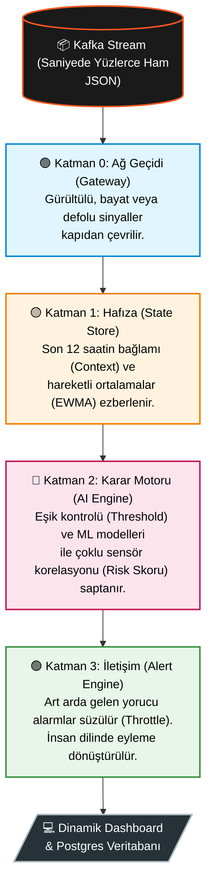

# 🔥 CODLEAN MES 
**The Intelligent Nervous System for Manufacturing Execution**

> *"Kusursuz Üretim İçin Kendi Kendini Dinleyen Yapay Zeka"*

Endüstriyel üretim hatları devasa, gürültülü ve karmaşıktır. Geleneksel OEE panelleri size sadece makinenin "bozulduğunu" söyler — yani iş işten geçtikten sonra. 

**Codlean MES**, makine sensörlerinden (Basınç, Yağ Sıcaklığı, Titreşim, Tork vb.) saniyede yüzlerce kez fırlayan anlık verilerin içine dalarak **"Yapay Zeka Destekli Bir Zaman Makinesi"** gibi çalışır. Sadece mevcut durumu göstermekle kalmaz; makinenin geçmişini ezberler, şimdisini denetler ve gelecekte ne zaman, hangi parçanın arıza vereceğini (*ETA: Estimated Time of Arrival*) saniyeler öncesinden hesaplar.

---

## 🌟 Neden Eşsiz? (The Peerless Architecture)

Piyasadaki standart "Kestirimci Bakım" (Predictive Maintenance) çözümleri çoğunlukla tek boyutludur. Codlean ise veriyi **4 farklı Akıl Katmanında** işleyerek bir "Dijital İkiz (Digital Twin)" bilinci yaratır:

### 1. Hiper-Hassas Hibrit Risk Motoru (Hybrid System)
Endüstri 4.0'da yapay zekanın en büyük problemi "Yanlış Alarm (False Positive)" korkusuyla gerçeği kaçırmasıdır. 
Codlean bu sorunu ustaca çözer: 
- **Teknisyen Aklı (%100 Kesin):** Kural tabanlı (Rule-based) limit aşımlarını kesin arıza olarak yakalar. 
- **YZ Aklı (Olası Tehlike):** ML (Random Forest/XGBoost) modelleri ile sınırları aşmamış ama *ivmelenen* mikroskobik trendleri 30-60 dakika önceden sezer.

### 2. Maliyet Odaklı (Cost-Aware) Refleks
Makinelerin patlaması, durmasından daha maliyetlidir. Sistem algoritması, *Recall* öncelikli çalışarak asgari şüphede bile teknik ekibi en açık ve net insan diliyle (Açıklanabilir AI) uyarır. (Örn: `🚨 Makineyi durdurun, yağ pompası basınç kaybediyor!`)

### 3. Zaman Makinesi Simülasyonu (Historical Replay) ⏳
Kafka ağ bağlantınız kopsa bile Codlean kör olmaz. Kendi içindeki eşsiz **Replay Engine** sayesinde, aylar önce yaşanmış devasa gerçek arıza loglarını (`violation_log.json`) sahte simülasyonlara başvurmadan saniye saniye canlı bir şekilde Dashboard'una basar ve sistem stres testine devam eder.

---

## 📸 Canlı İzleme Terminali (Dashboard)

Codlean, veri karmaşasını şık, modern, göz yormayan ve "renklerle konuşan" dinamik bir arayüze dönüştürür. 

🚨 **[Buraya Sistemin Ekran Görüntüsü Gelecek]** 🚨
*(Lütfen terminalde çalıştırdığınız sistemin ekran görüntüsünü `docs/images/dashboard-preview.png` dizinine kaydediniz. Görmek için kodu çalıştırın!)*


```bash
# Efsaneyi kendi bilgisayarınızda canlı izlemek için:
PYTHONPATH=. python src/ui/dashboard_pro.py
```

---

## 🏗️ 4-Katmanlı Yapay Zeka Pipeline (Fabrikasyon Süreci)

Ham veri teknisyenin ekranına düşene kadar şu katı denetimlerden geçer:



---

## ⚙️ Hemen Başlayın

Bu proje, bir "Hello World" kodlamasından ziyade, dev endüstriyel fabrikalarda doğrudan devreye alınmak üzere (**Production-Ready**) özel olarak inşa edilmiştir ve %100 Python tabanlı modüler bir yapı sunar.

Sistemin kurulum rehberi, derinlemesine geliştirici mimarisi, class hiyerarşileri ve detaylı ML eğitim raporları için [Geliştirici Dokümantasyonunu (PROJECT_DETAILS.md)](./PROJECT_DETAILS.md) inceleyebilirsiniz.
